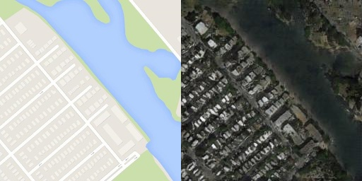

# Pytorch-Pix2Pix

Implementation of Pix2Pix generative model <3  

This repo contains code to train the models based on [Image-to-Image Translation with Conditional Adversarial Networks](https://arxiv.org/abs/1611.07004)  

The model is trained on Map and Satelite image dataset with Map images as the input domain and the Satelite images as the target domain.  

  


## Usage

The pretrained checkpoints can be loaded and be used directly with the ```convert.py``` script. It will convert the map images to satelite images with the output resolution as __256x256__.

> ```--src```: Path to the source image  
> ```--dest```: Path to the destination folder  
> ```--ckpth```: Path to the Generator model checkpoint  

For those who want to train the model from scratch on the same or different dataset can train it with the help of ```train.py```  

> ```--dataset```: Path to the dataset folder  
> ```--ckpth```(Optional): Path to/for saving the checkpoint for the models  
> ```--num_epoch```(Optional, default=200): Number of epochs for training the models  
> ```--batch_size```(Optional, default=1): The batch size for the dataloaders  
> ```--pixel```(Optional, default=100): Weight for L1 loss for training the generator  
> ```--lr```(Optional, default=0.0002): The learning rate for the optimizer  
> ```--beta1```(Optional, default=0.5): Adam optimizer momentum hyperparameter  
> ```--beta2```(Optional, default=0.999): Adam optimizer momentum hyperparameter  
> ```--cont```(Optional, default=False): Continue training the model  
> ```--device```(Optional, default=cpu): The training device  

## Files  

* __convert.py__: This script contains the code to convert the image from input domain to output domain. The checkpoints are required to run this script (```Generator.pth```)  
* __dataset.py__: This script is for creating a custom dataset for splitting the combined images to give separate map and satelite images  
* __models.py__: Contains the PatchGAN and U-net model for Discriminator and Generator respectively  
* __train.py__: The training scripts for the models with all the optimizer and loss functions  
* __utils.py__: Handy script for encoder and decoder block also having weight initialisation function as well  
